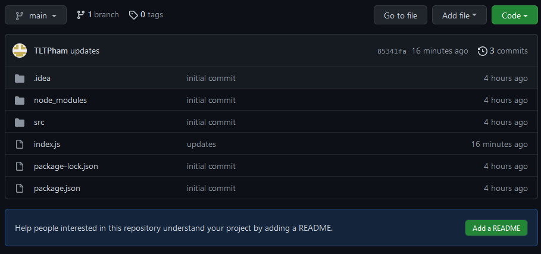
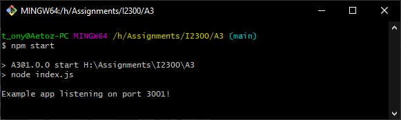

# Tony Pham Assignment 3

This is a README for Assignment 3
# To see the application hosted by Heroku

Go [here](https://i2300-a3.herokuapp.com/).
If it is not running, message Tony Pham.

# To use the App locally

1. Go to the GitHub page [here](https://github.com/TLTPham/a3).  
2. There should be a list of files and a dropdown on the right with **Code**. Open the dropdown and click **Download Zip**  
   
3. Unzip the file contents into a desired folder.
4. Run a terminal app (cmd/GitBash/Any IDE Terminal) in the root folder(desired folder).
5. Run ```npm start```. A message ```Example app listening on port ####!```  

8. If the application does not start, run ```npm install node``` and try again 
9. Once the application is running enter ```http://localhost:3001/``` (Port 3001 is default)
    - Side note: If the port is not 3001, put in which port the message said the application is running on.
